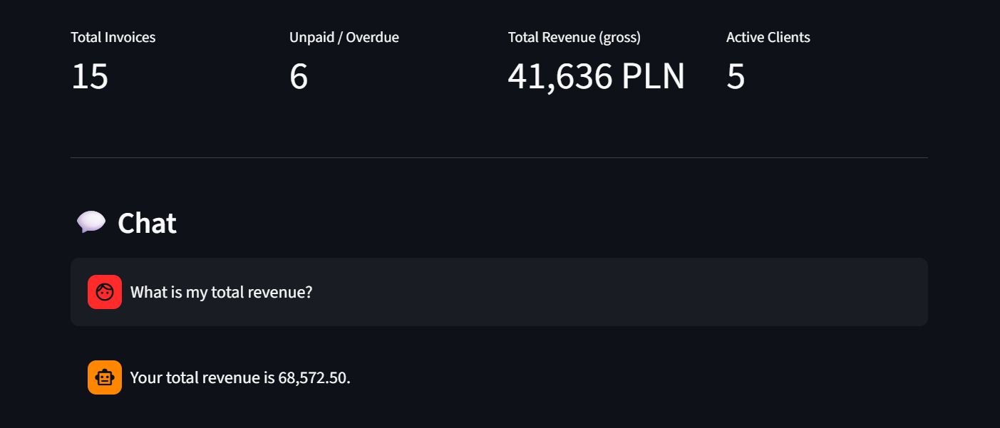
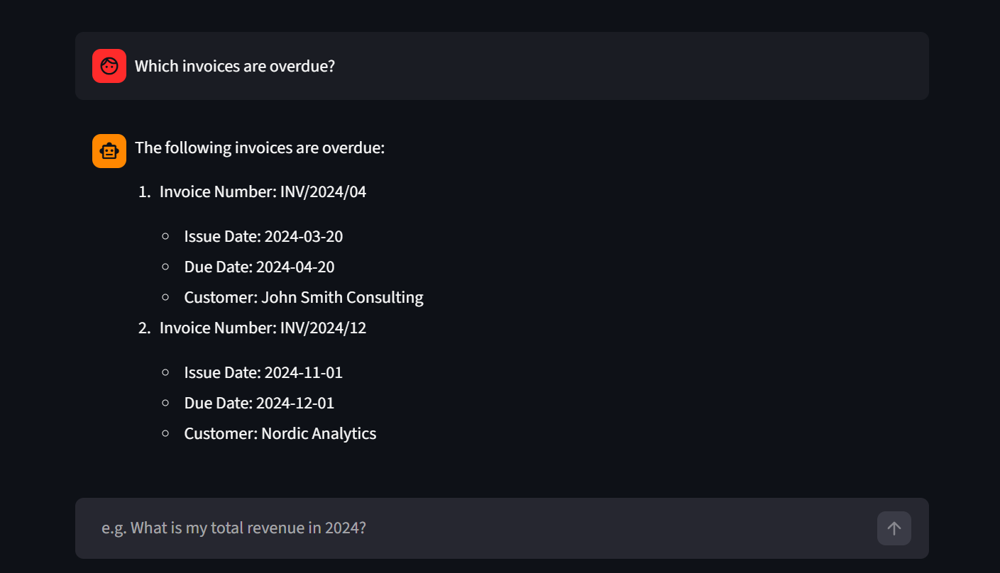
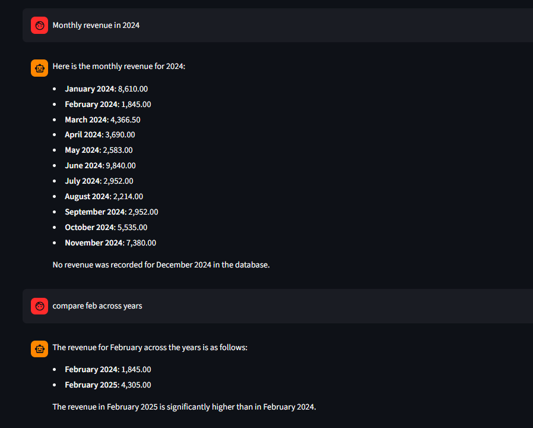
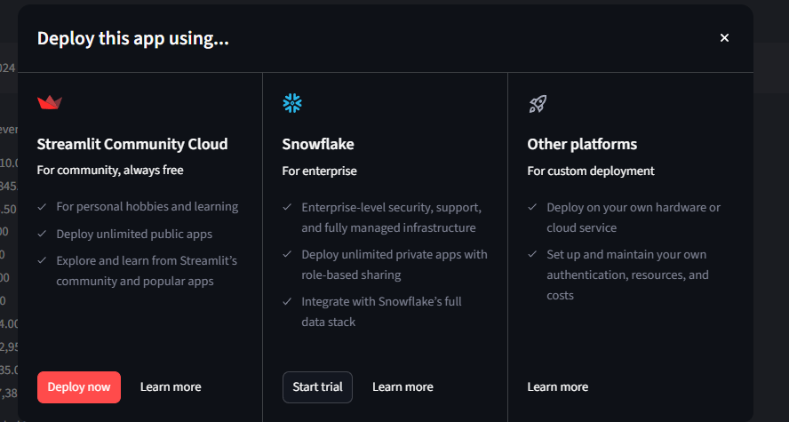
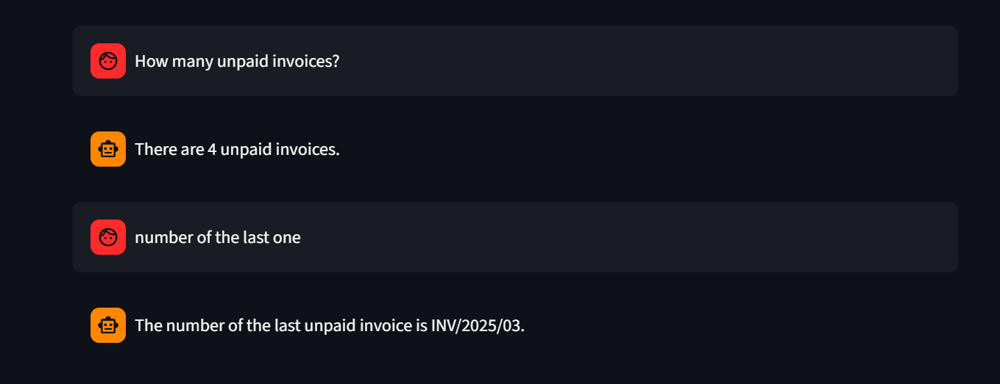

# GenAI Invoice Chatbot

An AI-powered invoice assistant for freelancers. Ask questions about your invoices in natural language - the chatbot queries the database and returns accurate answers without requiring any SQL knowledge.

Built as a graduation project for the Generative AI Foundations for Data Analytics Engineers course.

---

## Demo


*Real-time metrics dashboard showing total invoices, unpaid/overdue count, gross revenue and active clients*


*Query: "Which invoices are overdue?" — the model generates SQL, executes it and returns structured results*


*Monthly revenue breakdown for 2024 with year-over-year comparison*


*The chatbot refuses data modification requests — read-only access enforced via system prompt*


*Core logic — LLM loop with OpenAI function calling implementation*

---

## How it works

The user asks a question in plain English. The model decides to call the `execute_sql_query` function with a generated SQL query. The application executes the query against a local SQLite database and returns the result to the model. The model then formulates a natural language response based on the data.

This pattern is known as function calling - the LLM does not execute code directly, it returns a structured request that the application handles.

---

## Features

- Natural language interface - no SQL knowledge required
- GPT-4o function calling - the model decides when and how to query the database
- Live metrics dashboard - key business stats visible at a glance
- Suggested questions in the sidebar for quick exploration
- Read-only protection - INSERT, UPDATE, DELETE and DROP are blocked
- Conversation memory - full chat history maintained within the session
- Clear chat button to reset the conversation

---

## Tech stack

| Component | Technology |
|-----------|-----------|
| Language | Python 3.13 |
| LLM | GPT-4o via EPAM DIAL (Azure OpenAI) |
| AI Integration | OpenAI Python SDK (AzureOpenAI) |
| Database | SQLite |
| UI Framework | Streamlit |
| Configuration | python-dotenv |

---

## Project structure

```
genai-invoice-chatbot/
├── .env                  # API key
├── .gitignore
├── chatbot.py            # Main Streamlit application
├── create_db.py          # Database creation and seeding script
├── invoices.db           # SQLite database (generated locally)
├── screenshots/
│   ├── 01_dashboard_metrics.png
│   ├── 02_overdue_invoices.png
│   ├── 03_monthly_revenue.png
│   ├── 04_dml_protection.png
│   └── 05_function_calling_code.png
└── README.md
```

---

## Database schema

```sql
customers (id, name, nip, email, city, country)

invoices (id, number, customer_id, issue_date, due_date, status)
         -- status: 'paid', 'unpaid', 'overdue'

invoice_items (id, invoice_id, description, quantity, unit_price, vat_rate)
              -- net_amount   = quantity * unit_price
              -- gross_amount = quantity * unit_price * (1 + vat_rate)
```

The database contains 5 customers, 15 invoices spanning 2024 and 2025, and services such as IT Consulting, Data Analysis, ML Model Development, Python Training and Data Engineering.

---

## Setup and run

**1. Clone the repository**
```bash
git clone https://github.com/zielu2021/genai-invoice-chatbot.git
cd genai-invoice-chatbot
```

**2. Create a virtual environment**
```bash
python -m venv venv
venv\Scripts\activate      # Windows
source venv/bin/activate   # macOS/Linux
```

**3. Install dependencies**
```bash
pip install openai python-dotenv streamlit
```

**4. Configure the API key**

Create a `.env` file in the project root:
```
AZURE_OPENAI_API_KEY=your-api-key-here
```

**5. Create the database**
```bash
python create_db.py
```

**6. Run the application**
```bash
streamlit run chatbot.py
```

Open your browser at `http://localhost:8501`

---

## Example questions

| Question | What it demonstrates |
|----------|---------------------|
| What is my total revenue? | Aggregation across joined tables |
| Which invoices are overdue? | Filtered query by status |
| Show revenue by customer | GROUP BY with JOIN |
| Monthly revenue in 2024 | Date-based aggregation |
| Compare February across years | Year-over-year analysis |
| How much does John Smith owe me? | Customer-specific filtering |

---

## Safety rules

The chatbot only accepts SELECT statements. Any attempt to modify data is rejected with the message: "I am not allowed to modify data." The system prompt is not exposed to the user, and only invoice-related questions are answered.

---

## Course context

This project demonstrates the following skills from the EPAM GenAI course:

- OpenAI function calling using the tools parameter and tool_choice="auto"
- AzureOpenAI SDK integration with EPAM DIAL endpoint
- Conversational AI with persistent message history
- LLM-driven SQL generation and execution
- Streamlit for rapid AI application prototyping